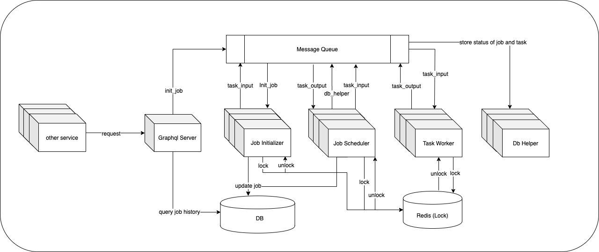

# Infrastructure




# Examples

```graphql
mutation begin{
  CreateJob(input: {
    comment: "demo"
    parameters: "{\"xxx\":{\"body\":\"abc\"},\"max_retry\": 1}"
    start_at: "test_grpc"
    tasks: [
      {
        name:"open_google_search"
        type: TASK
        next: "test_grpc"
        result_path: "${result.text}"
        endpoint: {
          protocol: HTTP
          method: GET
          url: "https://www.google.com/?hl=zh-tw"
          body: "${body}"
        },
        timeout: 10,
        retry: {
          error_on: [TIMEOUT]
          max_attempts: "${max_retry}"
          interval: 1
        }
		catch: {
          error_on: [ALL],
          next: "open_baidu_search"
        }
      },
      {
        name:"open_baidu_search",
        type: TASK,
        next: "test_grpc"
        endpoint: {
          protocol: HTTP
          method: GET
          url: "https://www.baidu.com/"
        },
        timeout: 60,
        retry: {
          error_on: [TIMEOUT]
          max_attempts: "${max_retry}"
          interval: 1
        }
      },
      {
        name: "test_grpc"
        type: TASK
        endpoint: {
          protocol: GRPC
          url: "example-grpc:10050"
          body:"#{Execution.CauseError}"
          symbol: "example.HealthService/Health"
        }
        result_path: "${result.getitem}"
        output_path: "${result.getitem}"
        end: true
      }
    ]
  })
}
```
